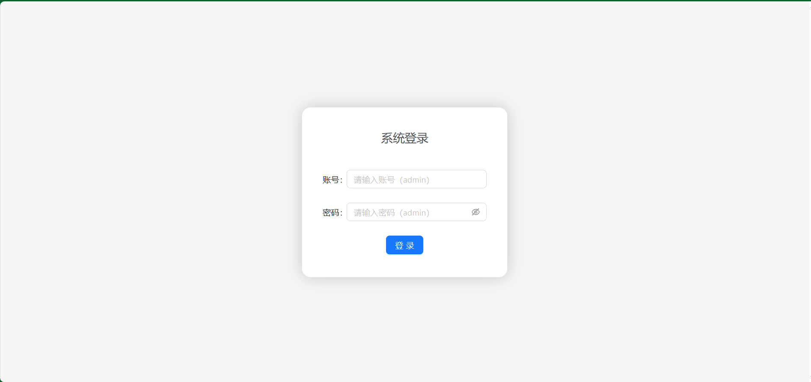
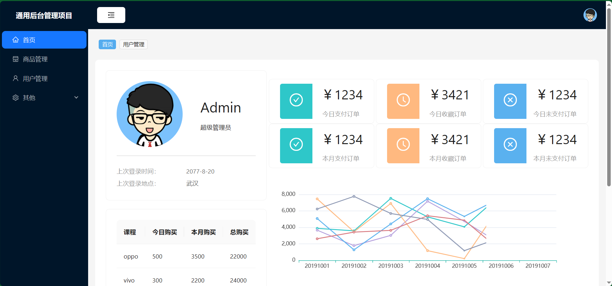
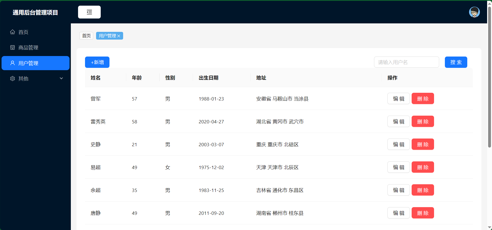

# React 通用后台管理项目

## 项目介绍
本项目是基于React的**通用后台管理系统**，整体系统有数据可视化展示，数据基本的**增删改查**功能。项目使用 [Create React App](https://github.com/facebook/create-react-app)创建，主语言为JavaScript。在使用React框架过程中通过hook进行页面逻辑编写。后端接口数据使用Mock进行模拟。

## 开源项目代码地址

[https://github.com/yaodada123/react-manage](https://github.com/yaodada123/react-manage)

## 在线运行地址(可能需要magic才可访问)

[https://react-manage-git-main-yaodada123s-projects.vercel.app/](https://react-manage-git-main-yaodada123s-projects.vercel.app/)

## 技术栈

- React 生态：React + React-Router + Redux + Axios + Babel + Webpack
- Echarts
- UI组件库：[Ant Design](https://ant-design.antgroup.com/index-cn)

## 项目运行部分效果

### 登录

### 主页

### 用户管理

## 开发环境

- IDE:VSCode

- node: v18.20.3
- npm: 10.7.0

## 项目启动

将项目克隆到本地后

1. npm install
2. npm start

即可成功运行